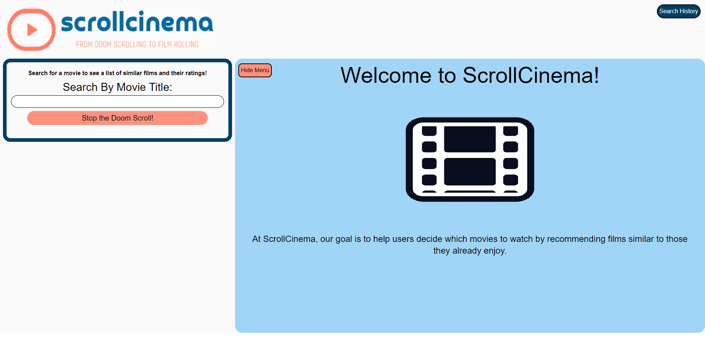

# TEST

## Table of Contents
- [Description](#description)
- [License](#license)
- [Website Page](#website-page)
- [Installation](#installation)
- [Usage](#usage)
- [Credits](#credits)
- [Contributions](#contributions)
- [Testing](#testing)
- [Questions](#questions)

## Description

* Test

### What was my motivation?

* Test

### Why did I build this project?

* Test

### What problem does this solve?

* Test

### What have I learned from this project?

* Test

## License:

This application is covered by the [MIT License](https://opensource.org/licenses/MIT).

## Website Page:

## Installation:

* Step 1
* Step 2

## Usage:

* How 1
* How 2
* How 3

## Credits:

* [Cred 1](cred.cred)
* [Cred 2](cred.cred)

## Contributions:

* Test

## Testing:

* Test 1
* Test 2
* Test 3

## Questions

#### My GitHub Profile:
* [Danyon-Talbot](https://github.com/Danyon-Talbot)

#### Additional Questions?

* If you have any additional questions, please reach out to me here: danyon.talbot2@gmail.com

